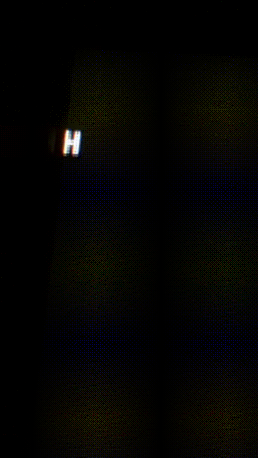

I have a OneChipBook that i have been using to learn to program fpgas, i got a char generator and a hacked to geather font curcuit working for drawing one char

Eventualy i want to figure out how to draw like a string of thease badboys along the monitor. 

Ive learned that my fontrom i built, and the vga timeing code i cobble togeather from online, we have some letters on the screen.

I know that the char rendering is wrong, I just dont know how to do it better, 

I think ill need to make another chip that takes in px and py, and perhaps output a pixel, then i could put a memory inside that chip, and it could hanlde keeping like a display memory for it to read and write to? If i do this, i think it turns into some simple math to figure out what char we are on, and then if the px of the char has to be on or not? 